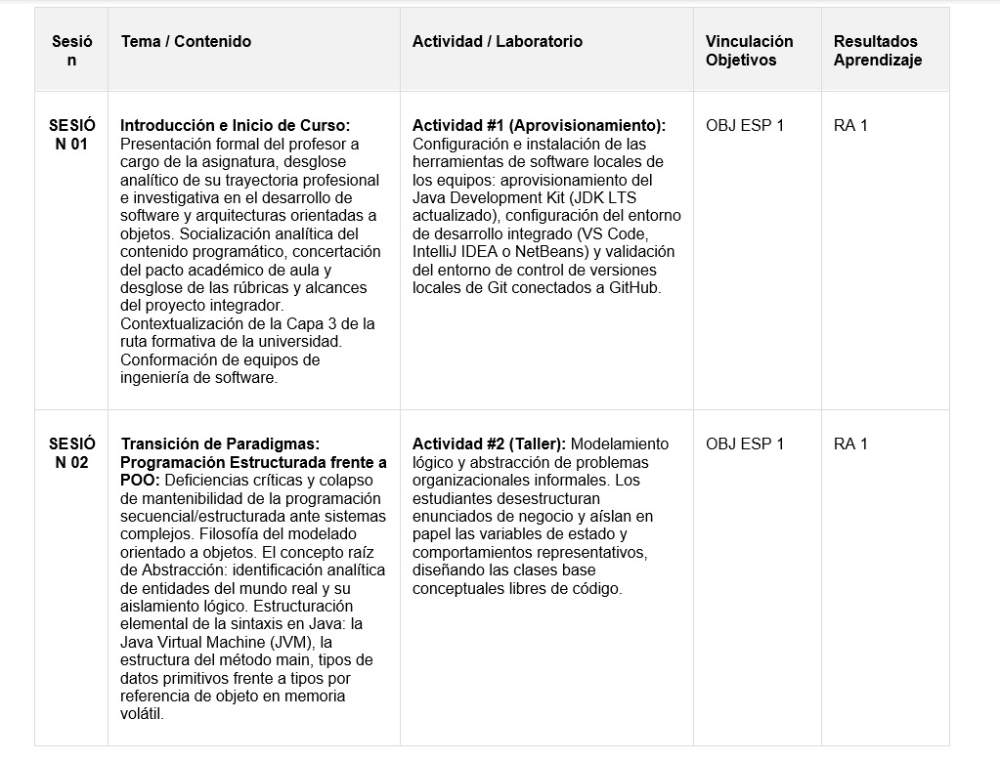
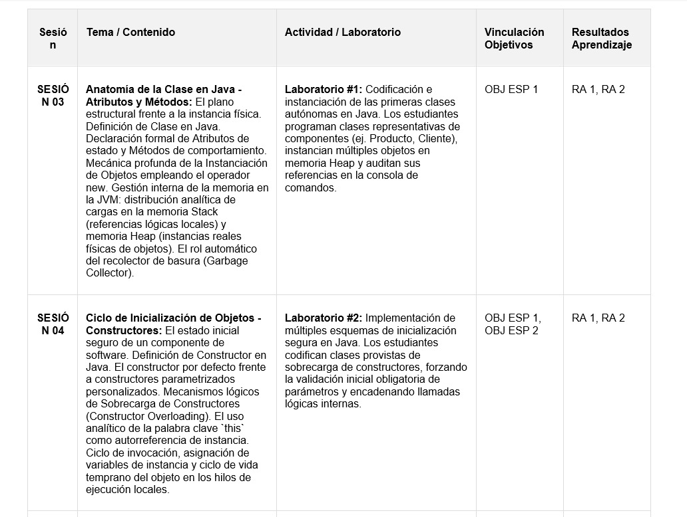
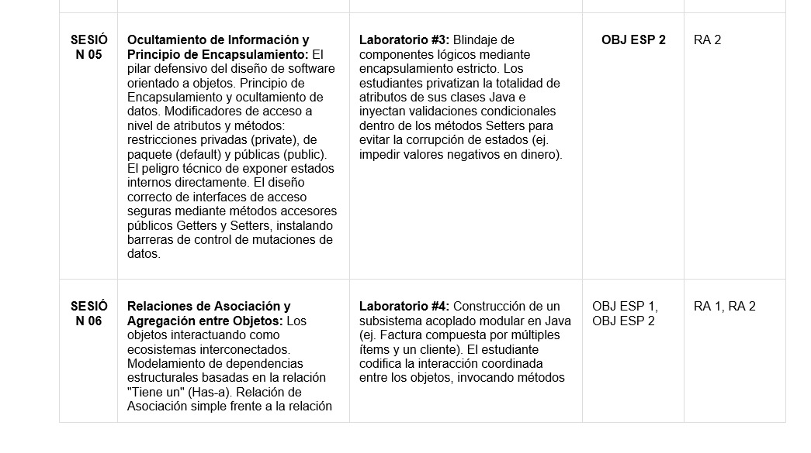
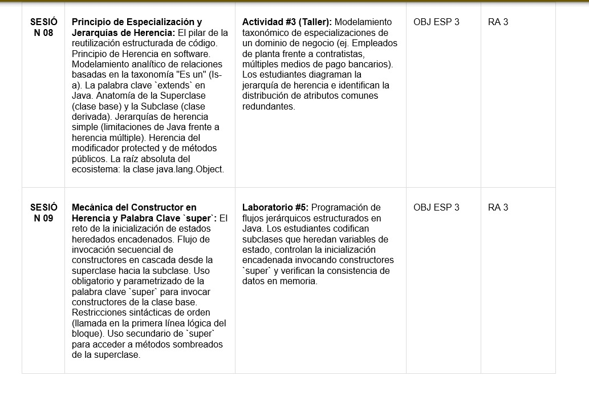
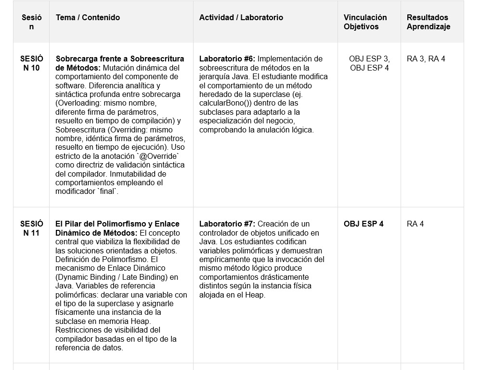
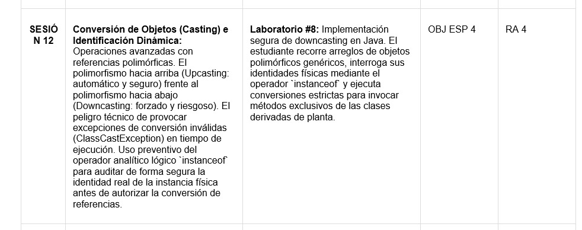

# POO en Java - Guía de Lógica

## Índice

1. Introducción
2. ¿Por qué Programación Orientada a Objetos?
3. Clases y Objetos
4. Creación de Objetos
5. Atributos
6. Métodos
7. Constructores
8. `this`
9. Encapsulamiento
10. Getters y Setters
11. Arreglos de Objetos
12. Búsquedas sobre Objetos
13. Recorridos
14. Máximos y mínimos
15. Contadores y acumuladores
16. Relaciones entre clases
17. Herencia
18. Polimorfismo
19. Ejercicio Integrador I
20. Ejercicio Integrador II
21. Desafíos para practicar

---

Sofi esta en la sesión 11